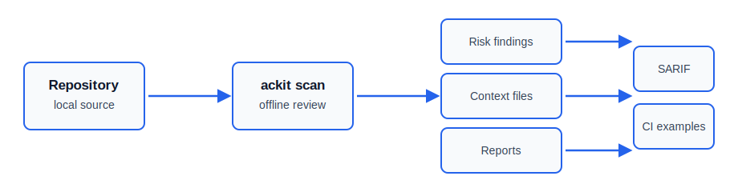

# AgentContextKit

[](https://github.com/Cynrath/agent-context-kit/actions/workflows/ci.yml)
[](https://github.com/Cynrath/agent-context-kit/actions/workflows/cross-platform-smoke.yml)
[](https://github.com/Cynrath/agent-context-kit/actions/workflows/cross-platform-source-smoke.yml)
[](https://www.nuget.org/packages/AgentContextKit)
[](https://www.nuget.org/packages/AgentContextKit)
[](LICENSE)
[](https://dotnet.microsoft.com/)

AI destekli geliştirme icin offline-first repository context ve guvenlik araci.

AgentContextKit, Codex, Claude Code, Cursor, GitHub Copilot, Gemini CLI ve benzeri AI coding agent kullanan gelistiriciler icin .NET tabanli bir CLI aracidir (`ackit`). Repository yapisini analiz eder, stack sinyallerini tespit eder, guvenli agent yonerge/workflow dosyalari uretir ve public release ya da AI context export oncesi secret/PII/marka sizinti risklerini raporlar.

Public repository URL: `https://github.com/Cynrath/agent-context-kit`

Current release: `v0.1.0-alpha.2` GitHub ve NuGet uzerinde yayinlandi; global tool kurulumu dogrulandi.

Kaynak notu: mevcut `master` source, `0.2.0-alpha.1` paket adayi olarak hazirlanir ve `ackit sarif` komutunu icerir. Yayinlanmis NuGet paketi `0.1.0-alpha.2` SARIF komutunu icermez.

## Preview
Web UI dashboard; readiness score, stack signals, health checks, findings, generated context files ve task previews alanlarini gosterir.



Screenshot dosyalari, sanitize edilmis public asset hazir olana kadar bilerek commitlenmez. Ayrinti icin [Web UI Preview](docs/WEB_UI_PREVIEW.md), [Visual Assets](docs/VISUAL_ASSETS.md), [Sample Gallery](docs/SAMPLE_GALLERY.md) ve [Demo Scenarios](docs/DEMO_SCENARIOS.md) dosyalarina bakin.

## Problem
AI coding agent'lar cogu projede eksik, eski veya guvensiz context ile calisir. Bu durum yanlis dosya degisikligi, production ayari sizintisi, zayif task plani, eksik test, tutarsiz agent yonergeleri ve private projenin public hale gelirken hassas bilgi sizdirmasi gibi riskler dogurur.

## Cozum
AgentContextKit lokal ve tekrarlanabilir bir workflow kurar:
- Repository yapisini ve stack sinyallerini tarar.
- Kisa bir project map uretir.
- AI agent yonerge dosyalari uretir.
- Task-first gelistirme dokumanlari olusturur.
- Riskli dosyalari ve secret benzeri icerigi raporlar.
- Var olan dosyalari varsayilan olarak ezmez.

## Kimler Kullanmalı
- AI-assisted development yapan gelistiriciler.
- Acik kaynak maintainer'lari.
- Freelance, ajans ve kucuk ekipler.
- Private repository'yi public yapmadan once temizlik yapmak isteyen ekipler.
- Codex/Claude/Cursor/Copilot icin tutarli proje context'i isteyen gelistiriciler.

## Neden Offline-first
MVP uzak AI API cagrisi yapmaz ve repository icerigini yuklemez. Bu yaklasim private kodu lokalde tutar, veri sizintisi riskini azaltir ve kisitli ortamlarda kullanimi kolaylastirir.

## Ozellikler
- `ackit init`: `.ackit/config.yml` olusturur, var olan config'i ezmez.
- `ackit scan`: stack, docs, test, CI, Docker, agent dosyalari ve riskli yolları tespit eder.
- `ackit scan --ci`: high veya critical risk bulgularinda otomasyon kontrollerini basarisiz yapar.
- Stabil scanner rule ID'leri ve safe technical domain, bilinen non-Critical path ve kabul edilen non-Critical rule ID'leri icin dar config allowlist destegi.
- `ackit sarif`: CI/security incelemesi icin privacy-first SARIF 2.1.0 tarama raporu uretir. Mevcut source ve `0.2.0-alpha.1` paket adayi icinde vardir.
- `ackit report`: offline statik HTML tarama raporu uretir.
- `ackit webui`: tarama incelemesi icin offline statik Web UI prototipi uretir.
- `ackit prompt-pack`: remote cagri yapmadan gelecekteki LLM context incelemesi icin lokal dry-run prompt paketi uretir.
- `ackit context-export`: incelenmis prompt paketi icin upload yapmadan lokal onay manifesti uretir.
- `ackit generate`: desteklenen agent hedefleri icin context ve workflow dosyalari uretir.
- `ackit task`: `docs/tasks` altinda yapilandirilmis task dosyasi olusturur.
- `ackit redact-check`: secret/PII/marka/local path risklerini raporlar.
- `ackit doctor`: OSS ve repository saglik kontrollerini raporlar.
- `--json`: otomasyon uyumlu machine-readable JSON cikti uretir.
- English ve Turkish output/template temeli.

## Hizli Baslangic
Kaynak koddan:

```powershell
dotnet restore
dotnet build -c Release
dotnet run --project src/AgentContextKit.Cli -- --help
dotnet run --project src/AgentContextKit.Cli -- scan
dotnet run --project src/AgentContextKit.Cli -- scan --ci
dotnet run --project src/AgentContextKit.Cli -- scan --json
dotnet run --project src/AgentContextKit.Cli -- sarif --output .ackit/reports/ackit.sarif
dotnet run --project src/AgentContextKit.Cli -- report --json
dotnet run --project src/AgentContextKit.Cli -- webui --json
dotnet run --project src/AgentContextKit.Cli -- prompt-pack --json
dotnet run --project src/AgentContextKit.Cli -- context-export --prompt-pack .ackit/prompt-packs/prompt-pack.md --approve --json
dotnet run --project src/AgentContextKit.Cli -- task "Yetki kontrollerini ekle" --lang tr
```

NuGet ile kurulum:

```powershell
dotnet tool install --global AgentContextKit --version 0.1.0-alpha.2
ackit --help
ackit version
ackit scan --ci
```

Yayinlanmis `0.1.0-alpha.2` paketi `ackit sarif` komutunu icermez. `0.2.0-alpha.1` yayinlanana kadar yukaridaki source komutunu kullanin.

Kurulu tool icin hizli dogrulama:

```powershell
$smoke = Join-Path $env:TEMP "ackit-smoke-test"
New-Item -ItemType Directory -Force -Path $smoke | Out-Null
Push-Location $smoke
dotnet new console -n DemoApp
Push-Location DemoApp
git init
ackit init --lang tr
ackit scan --ci
ackit generate --target all --lang tr
ackit task "Demo smoke test gorevi" --lang tr
ackit report --output .ackit/reports/smoke.html
ackit webui --output .ackit/webui/index.html
ackit prompt-pack --output .ackit/prompt-packs/smoke.md --json
ackit context-export --prompt-pack .ackit/prompt-packs/smoke.md --approve --output .ackit/context-exports/smoke.json --json
Pop-Location
Pop-Location
```

Minimal demo app icinde `ackit doctor`, README, LICENSE, SECURITY, test, CI, `.gitignore` veya package metadata eksiklerini raporlayabilir. Bu beklenen repository-health ciktisidir, tool hatasi degildir.

Cross-platform yayinlanmis-paket smoke kapsami `.github/workflows/cross-platform-smoke.yml` ile takip edilir. Workflow, Windows, Ubuntu ve macOS uzerinde `AgentContextKit` `0.1.0-alpha.2` paketini global tool olarak kurar ve temiz demo app uzerinde kurulu-tool smoke akisini calistirir.
Mevcut kaynak smoke kapsami `.github/workflows/cross-platform-source-smoke.yml` ile takip edilir. Bu workflow mevcut branch'i lokalde paketler ve paketi yayin yapmadan gecici package source uzerinden kurar.
Tested on Windows, Ubuntu, and macOS via GitHub Actions.

## Ornek Uzerinde Dene
```powershell
Push-Location samples/dotnet-console
dotnet run --project ../../src/AgentContextKit.Cli/AgentContextKit.Cli.csproj -c Release --no-build -- scan --ci
Pop-Location
```

Daha fazla rehberli ornek icin [Sample Gallery](docs/SAMPLE_GALLERY.md) ve [Demo Scenarios](docs/DEMO_SCENARIOS.md) dosyalarina bakin.

## CLI Komutlari
`ackit sarif`, mevcut source ve `0.2.0-alpha.1` paket adayinin parcasidir; yayinlanmis `0.1.0-alpha.2` NuGet global tool icinde yoktur.

```text
ackit init [--lang en|tr] [--json]
ackit scan [--lang en|tr] [--json] [--ci]
ackit sarif --output <repo-relative.sarif> [--lang en|tr] [--json]
ackit report [--output <repo-relative.html>] [--lang en|tr] [--json]
ackit webui [--output <repo-relative.html>] [--lang en|tr] [--json]
ackit prompt-pack [--output <repo-relative.md>] [--lang en|tr] [--json]
ackit context-export --prompt-pack <repo-relative.md> --approve [--output <repo-relative.json>] [--lang en|tr] [--json]
ackit generate [--target codex|claude|cursor|copilot|all] [--lang en|tr] [--json]
ackit task "<baslik>" [--lang en|tr] [--json]
ackit redact-check [--profile public-release] [--lang en|tr] [--json]
ackit doctor [--lang en|tr] [--json]
ackit version
ackit --help
```

## Uretilen Dosyalar
Komuta ve hedefe gore AgentContextKit su dosyalari uretebilir:
- `AGENTS.md`
- `CLAUDE.md`
- `.cursor/rules/project.mdc`
- `.github/copilot-instructions.md`
- `docs/PROJECT_MAP.md`
- `docs/AI_WORKFLOW.md`
- `docs/SECURITY_NOTES.md`
- `docs/DEVELOPMENT_STANDARD.md`
- `docs/tasks/TASK-0001.md`
- `.codex/HANDOFF.md`
- `.codex/CONTEXT_PACK.md`
- `.ackit/reports/scan-report.html`
- `.ackit/reports/ackit.sarif`
- `.ackit/webui/index.html`
- `.ackit/prompt-packs/prompt-pack.md`
- `.ackit/context-exports/context-export-manifest.json`

## Guvenli Davranis
- Var olan dosyalar varsayilan olarak atlanir.
- MVP otomatik secret redaction yapmaz.
- Uzak servise upload yapmaz.
- Statik rapor ve Web UI dosyalari lokal ve self-contained uretilir; lokal repository path gosterebilir ve public release artifact olarak paylasilmamalidir.
- SARIF raporlari lokal generated artifact'tir; file location degerleri repository-relative yazilir ve ham secret match degerleri SARIF'e yazilmaz.
- Prompt paketleri lokal dry-run ciktisidir ve remote LLM provider cagrisi yapmaz.
- Context export manifestleri sadece lokal onayi kaydeder ve content upload yapmaz.
- GitHub push veya NuGet publish yapmaz.
- Risk raporlari severity bazlidir: Critical, High, Medium, Low, Info.
- Scanner, yaygin platform/package domainleri ve acikca gercek olmayan fixture placeholder degerleri icin dar bir safe technical allowlist kullanir; Critical secret patternleri raporlanmaya devam eder.
- Config scanner allowlist'leri non-Critical noise bulgularini bastirabilir, ancak Critical bulgular raporlanmaya devam eder.

## Lokalizasyon
Varsayilan dil English'tir. Turkish icin `--lang tr` kullanilir. Bilinmeyen dil degeri English'e duser.
Turkish human-readable CLI output UTF-8 Turkce karakterler kullanabilir; JSON field adlari ve schema degerleri English/stable kalir.

## Konfigurasyon Ve JSON
`.ackit/config.yml` icin [docs/CONFIGURATION.md](docs/CONFIGURATION.md), machine-readable cikti icin [docs/JSON_OUTPUT.md](docs/JSON_OUTPUT.md) dosyasina bakin.

## Dokumantasyon
Baslangic icin [docs/DOCUMENTATION_INDEX.md](docs/DOCUMENTATION_INDEX.md) dosyasina bakin.

Onemli dokumanlar:
- [CLI Reference](docs/CLI_REFERENCE.md)
- [Examples](docs/EXAMPLES.md)
- [Sample Gallery](docs/SAMPLE_GALLERY.md)
- [Demo Scenarios](docs/DEMO_SCENARIOS.md)
- [Web UI Preview](docs/WEB_UI_PREVIEW.md)
- [Visual Assets](docs/VISUAL_ASSETS.md)
- [GitHub Actions Usage](docs/GITHUB_ACTIONS_USAGE.md)
- [Configuration](docs/CONFIGURATION.md)
- [Scanner Rules](docs/SCANNER_RULES.md)
- [JSON Output](docs/JSON_OUTPUT.md)
- [Exit Codes](docs/EXIT_CODES.md)
- [HTML Reports](docs/HTML_REPORTS.md)
- [SARIF Output](docs/SARIF_OUTPUT.md)
- [Web UI Prototype](docs/WEB_UI_PROTOTYPE.md)
- [Troubleshooting](docs/TROUBLESHOOTING.md)
- [Architecture](docs/ARCHITECTURE.md)
- [Source Hygiene](docs/SOURCE_HYGIENE.md)
- [Security Model](docs/SECURITY_MODEL.md)
- [Packaging](docs/PACKAGING.md)
- [Contributor Onboarding](docs/CONTRIBUTOR_ONBOARDING.md)
- [Support Matrix](docs/SUPPORT_MATRIX.md)
- [GitHub Labels](docs/GITHUB_LABELS.md)
- [GitHub Settings Checklist](docs/GITHUB_SETTINGS_CHECKLIST.md)
- [Maintainer Guide](docs/MAINTAINER_GUIDE.md)
- [GitHub Repo Hygiene](docs/GITHUB_REPO_HYGIENE.md)
- [Issue Triage](docs/ISSUE_TRIAGE.md)
- [Maintainer Release Handoff](docs/MAINTAINER_RELEASE_HANDOFF.md)
- [Public Release Audit](docs/PUBLIC_RELEASE_AUDIT.md)
- [Release Validation](docs/RELEASE_VALIDATION.md)
- [Release Blockers](docs/RELEASE_BLOCKERS.md)

## Roadmap
Bkz. [docs/ROADMAP.md](docs/ROADMAP.md).

## Paketleme
Lokal paket dogrulama adimlari [docs/PACKAGING.md](docs/PACKAGING.md) ve [docs/RELEASE_VALIDATION.md](docs/RELEASE_VALIDATION.md) dosyalarinda yer alir. `0.1.0-alpha.2` paketi NuGet global tool olarak yayinlandi; mevcut source `0.2.0-alpha.1` paket adayi olarak hazirlanir.

Public release blocker listesi [docs/RELEASE_BLOCKERS.md](docs/RELEASE_BLOCKERS.md) dosyasinda takip edilir.

## Katki
Bkz. [CONTRIBUTING.md](CONTRIBUTING.md) ve [docs/CONTRIBUTOR_ONBOARDING.md](docs/CONTRIBUTOR_ONBOARDING.md). GitHub issue ve pull request template'lerini kullanin; public raporlarda secret veya private repository verisi paylasmayin.

## Guvenlik
Bkz. [SECURITY.md](SECURITY.md). Public issue'larda secret, private repository icerigi veya production config paylasmayin.

## Lisans
MIT. Bkz. [LICENSE](LICENSE).
